Case Study - Bellabeat
================
María Emilia Sabbatini
2023-01-04

### Defining the case

The task to perform is to define marketing strategies for the Bellabeat
fitness/lifestyle tracking devices that monitor physical activity,
weight, heart rate, sleep hours, among other parameters. The data
supplied for this analysis comes from user data provided by a competitor
company (FitBit).

The purpose of this analysis aims to come to conclusions about the use
of these devices and come up with recommendations or strategies to the
company.

1.  Business task: to analyze the data and identify relationships,
    tendencies, statistical values and so on in order to be able to
    establish marketing and business recommendations for the Bellabeat
    products.
2.  The main stake holders are the company’s founders, who required this
    task.

------------------------------------------------------------------------

### Preparing the case

The data is uploaded to the Kaggle platform, and have a public domain
license (CCO). The data was generated between 2012/12/03 and 2012/12/12
and comes from 30 users who voluntarily submitted their devices’ data to
the FitBit company. The data provided comes from different FitBit
devices or models so there may be differences.

The available data is organized in 18 .csv files that contain daily logs
of many parameters(calories, heart rate, steps, sleep hours, etc.). Most
tables are in wide format.

It can’t be determined at a first glance if there is bias in the data,
that’s because there is no sufficient information as for how they were
obtained or about the population sampled (demographics). It is known
that the data was gathered via an online Amazon survey from 30 users.

The Kaggle platform assures credibility of the data since the data
source and update frequency are listed and the fact that the notebook is
public. Privacy and security of the data are not addressed since they
are of public access. The integrity of the data cannot be assessed
thoroughly but the data recollection and sources can be determined:
participants were recruited by an online survey on Amazon’s Mechanical
Turk Prime, and eligible solicitors agreed to synchronize their Fitbit
devices’ data with the FitaBase software (a third party company), which
enabled the researchers to link it to participants’ survey results,
keeping their individual identification data anonymous at all times.

------------------------------------------------------------------------

### Processing the data

The choice is to process the data with R via Posit Cloud (former RStudio
Cloud). This decision is supported in the amount of tables and the high
number of observations available.

------------------------------------------------------------------------

### Uploading the data

As a first step, I uploaded a .zip file containing all .csv files with
the FitBit data to the project’s cloud. Then, I installed and called the
*tidyverse* package to use the *read_csv* function in order to make data
frames from the .csv files.

``` r
install.packages('tidyverse')
```

    ## Installing package into '/cloud/lib/x86_64-pc-linux-gnu-library/4.2'
    ## (as 'lib' is unspecified)

``` r
library('tidyverse')
```

    ## ── Attaching packages
    ## ───────────────────────────────────────
    ## tidyverse 1.3.2 ──

    ## ✔ ggplot2 3.4.0      ✔ purrr   1.0.0 
    ## ✔ tibble  3.1.8      ✔ dplyr   1.0.10
    ## ✔ tidyr   1.2.1      ✔ stringr 1.5.0 
    ## ✔ readr   2.1.3      ✔ forcats 0.5.2 
    ## ── Conflicts ────────────────────────────────────────── tidyverse_conflicts() ──
    ## ✖ dplyr::filter() masks stats::filter()
    ## ✖ dplyr::lag()    masks stats::lag()

``` r
d_Activity<-read_csv("/cloud/project/Fitabase Data 4.12.16-5.12.16/dailyActivity_merged.csv")
```

    ## Rows: 940 Columns: 15
    ## ── Column specification ────────────────────────────────────────────────────────
    ## Delimiter: ","
    ## chr  (1): ActivityDate
    ## dbl (14): Id, TotalSteps, TotalDistance, TrackerDistance, LoggedActivitiesDi...
    ## 
    ## ℹ Use `spec()` to retrieve the full column specification for this data.
    ## ℹ Specify the column types or set `show_col_types = FALSE` to quiet this message.

I used the *file.choose()* function to easily obtain each file path to
insert in the *read_csv()* function. By calling this function, a window
opens where the desired file can be chosen. The function returns the
path to that file, which I copied then to the *read_csv()* function.

``` r
d_Sleep<-read_csv("/cloud/project/Fitabase Data 4.12.16-5.12.16/sleepDay_merged.csv")
```

    ## Rows: 413 Columns: 5
    ## ── Column specification ────────────────────────────────────────────────────────
    ## Delimiter: ","
    ## chr (1): SleepDay
    ## dbl (4): Id, TotalSleepRecords, TotalMinutesAsleep, TotalTimeInBed
    ## 
    ## ℹ Use `spec()` to retrieve the full column specification for this data.
    ## ℹ Specify the column types or set `show_col_types = FALSE` to quiet this message.

``` r
weight<-read_csv("/cloud/project/Fitabase Data 4.12.16-5.12.16/weightLogInfo_merged.csv")
```

    ## Rows: 67 Columns: 8
    ## ── Column specification ────────────────────────────────────────────────────────
    ## Delimiter: ","
    ## chr (1): Date
    ## dbl (6): Id, WeightKg, WeightPounds, Fat, BMI, LogId
    ## lgl (1): IsManualReport
    ## 
    ## ℹ Use `spec()` to retrieve the full column specification for this data.
    ## ℹ Specify the column types or set `show_col_types = FALSE` to quiet this message.

I created data frames for nearly every .csv file in the dataset. Next
step is to clean the data in order to prevent biases in the information.

------------------------------------------------------------------------

### Cleaning the data

The cleaning process can entail many steps. Common steps include:

- Deleting duplicates
- Removing NAs if necessary
- Removing specific rows according to a given condition
- Normalizing format across tables - this includes changing case,
  changing date/time formats, fixing numbers, splitting or merging
  columns, etc.
- Check spelling and grammar
- Removing spacing
- Transposing if necessary for the analysis to be performed
- Reconciling joint or merged tables

#### 1-Deleting duplicates:

First of all I will look for duplicates. This can be done passing the
*duplicated()* function and getting the sum (=0 when there are no
duplicates). The *duplicated()* function will return boolean values for
the rows (TRUE for duplicates,FALSE if not).

``` r
duplicated(d_Activity)
```

    ##   [1] FALSE FALSE FALSE FALSE FALSE FALSE FALSE FALSE FALSE FALSE FALSE FALSE
    ##  [13] FALSE FALSE FALSE FALSE FALSE FALSE FALSE FALSE FALSE FALSE FALSE FALSE
    ##  [25] FALSE FALSE FALSE FALSE FALSE FALSE FALSE FALSE FALSE FALSE FALSE FALSE
    ##  [37] FALSE FALSE FALSE FALSE FALSE FALSE FALSE FALSE FALSE FALSE FALSE FALSE
    ##  [49] FALSE FALSE FALSE FALSE FALSE FALSE FALSE FALSE FALSE FALSE FALSE FALSE
    ##  [61] FALSE FALSE FALSE FALSE FALSE FALSE FALSE FALSE FALSE FALSE FALSE FALSE
    ##  [73] FALSE FALSE FALSE FALSE FALSE FALSE FALSE FALSE FALSE FALSE FALSE FALSE
    ##  [85] FALSE FALSE FALSE FALSE FALSE FALSE FALSE FALSE FALSE FALSE FALSE FALSE
    ##  [97] FALSE FALSE FALSE FALSE FALSE FALSE FALSE FALSE FALSE FALSE FALSE FALSE
    ## [109] FALSE FALSE FALSE FALSE FALSE FALSE FALSE FALSE FALSE FALSE FALSE FALSE
    ## [121] FALSE FALSE FALSE FALSE FALSE FALSE FALSE FALSE FALSE FALSE FALSE FALSE
    ## [133] FALSE FALSE FALSE FALSE FALSE FALSE FALSE FALSE FALSE FALSE FALSE FALSE
    ## [145] FALSE FALSE FALSE FALSE FALSE FALSE FALSE FALSE FALSE FALSE FALSE FALSE
    ## [157] FALSE FALSE FALSE FALSE FALSE FALSE FALSE FALSE FALSE FALSE FALSE FALSE
    ## [169] FALSE FALSE FALSE FALSE FALSE FALSE FALSE FALSE FALSE FALSE FALSE FALSE
    ## [181] FALSE FALSE FALSE FALSE FALSE FALSE FALSE FALSE FALSE FALSE FALSE FALSE
    ## [193] FALSE FALSE FALSE FALSE FALSE FALSE FALSE FALSE FALSE FALSE FALSE FALSE
    ## [205] FALSE FALSE FALSE FALSE FALSE FALSE FALSE FALSE FALSE FALSE FALSE FALSE
    ## [217] FALSE FALSE FALSE FALSE FALSE FALSE FALSE FALSE FALSE FALSE FALSE FALSE
    ## [229] FALSE FALSE FALSE FALSE FALSE FALSE FALSE FALSE FALSE FALSE FALSE FALSE
    ## [241] FALSE FALSE FALSE FALSE FALSE FALSE FALSE FALSE FALSE FALSE FALSE FALSE
    ## [253] FALSE FALSE FALSE FALSE FALSE FALSE FALSE FALSE FALSE FALSE FALSE FALSE
    ## [265] FALSE FALSE FALSE FALSE FALSE FALSE FALSE FALSE FALSE FALSE FALSE FALSE
    ## [277] FALSE FALSE FALSE FALSE FALSE FALSE FALSE FALSE FALSE FALSE FALSE FALSE
    ## [289] FALSE FALSE FALSE FALSE FALSE FALSE FALSE FALSE FALSE FALSE FALSE FALSE
    ## [301] FALSE FALSE FALSE FALSE FALSE FALSE FALSE FALSE FALSE FALSE FALSE FALSE
    ## [313] FALSE FALSE FALSE FALSE FALSE FALSE FALSE FALSE FALSE FALSE FALSE FALSE
    ## [325] FALSE FALSE FALSE FALSE FALSE FALSE FALSE FALSE FALSE FALSE FALSE FALSE
    ## [337] FALSE FALSE FALSE FALSE FALSE FALSE FALSE FALSE FALSE FALSE FALSE FALSE
    ## [349] FALSE FALSE FALSE FALSE FALSE FALSE FALSE FALSE FALSE FALSE FALSE FALSE
    ## [361] FALSE FALSE FALSE FALSE FALSE FALSE FALSE FALSE FALSE FALSE FALSE FALSE
    ## [373] FALSE FALSE FALSE FALSE FALSE FALSE FALSE FALSE FALSE FALSE FALSE FALSE
    ## [385] FALSE FALSE FALSE FALSE FALSE FALSE FALSE FALSE FALSE FALSE FALSE FALSE
    ## [397] FALSE FALSE FALSE FALSE FALSE FALSE FALSE FALSE FALSE FALSE FALSE FALSE
    ## [409] FALSE FALSE FALSE FALSE FALSE FALSE FALSE FALSE FALSE FALSE FALSE FALSE
    ## [421] FALSE FALSE FALSE FALSE FALSE FALSE FALSE FALSE FALSE FALSE FALSE FALSE
    ## [433] FALSE FALSE FALSE FALSE FALSE FALSE FALSE FALSE FALSE FALSE FALSE FALSE
    ## [445] FALSE FALSE FALSE FALSE FALSE FALSE FALSE FALSE FALSE FALSE FALSE FALSE
    ## [457] FALSE FALSE FALSE FALSE FALSE FALSE FALSE FALSE FALSE FALSE FALSE FALSE
    ## [469] FALSE FALSE FALSE FALSE FALSE FALSE FALSE FALSE FALSE FALSE FALSE FALSE
    ## [481] FALSE FALSE FALSE FALSE FALSE FALSE FALSE FALSE FALSE FALSE FALSE FALSE
    ## [493] FALSE FALSE FALSE FALSE FALSE FALSE FALSE FALSE FALSE FALSE FALSE FALSE
    ## [505] FALSE FALSE FALSE FALSE FALSE FALSE FALSE FALSE FALSE FALSE FALSE FALSE
    ## [517] FALSE FALSE FALSE FALSE FALSE FALSE FALSE FALSE FALSE FALSE FALSE FALSE
    ## [529] FALSE FALSE FALSE FALSE FALSE FALSE FALSE FALSE FALSE FALSE FALSE FALSE
    ## [541] FALSE FALSE FALSE FALSE FALSE FALSE FALSE FALSE FALSE FALSE FALSE FALSE
    ## [553] FALSE FALSE FALSE FALSE FALSE FALSE FALSE FALSE FALSE FALSE FALSE FALSE
    ## [565] FALSE FALSE FALSE FALSE FALSE FALSE FALSE FALSE FALSE FALSE FALSE FALSE
    ## [577] FALSE FALSE FALSE FALSE FALSE FALSE FALSE FALSE FALSE FALSE FALSE FALSE
    ## [589] FALSE FALSE FALSE FALSE FALSE FALSE FALSE FALSE FALSE FALSE FALSE FALSE
    ## [601] FALSE FALSE FALSE FALSE FALSE FALSE FALSE FALSE FALSE FALSE FALSE FALSE
    ## [613] FALSE FALSE FALSE FALSE FALSE FALSE FALSE FALSE FALSE FALSE FALSE FALSE
    ## [625] FALSE FALSE FALSE FALSE FALSE FALSE FALSE FALSE FALSE FALSE FALSE FALSE
    ## [637] FALSE FALSE FALSE FALSE FALSE FALSE FALSE FALSE FALSE FALSE FALSE FALSE
    ## [649] FALSE FALSE FALSE FALSE FALSE FALSE FALSE FALSE FALSE FALSE FALSE FALSE
    ## [661] FALSE FALSE FALSE FALSE FALSE FALSE FALSE FALSE FALSE FALSE FALSE FALSE
    ## [673] FALSE FALSE FALSE FALSE FALSE FALSE FALSE FALSE FALSE FALSE FALSE FALSE
    ## [685] FALSE FALSE FALSE FALSE FALSE FALSE FALSE FALSE FALSE FALSE FALSE FALSE
    ## [697] FALSE FALSE FALSE FALSE FALSE FALSE FALSE FALSE FALSE FALSE FALSE FALSE
    ## [709] FALSE FALSE FALSE FALSE FALSE FALSE FALSE FALSE FALSE FALSE FALSE FALSE
    ## [721] FALSE FALSE FALSE FALSE FALSE FALSE FALSE FALSE FALSE FALSE FALSE FALSE
    ## [733] FALSE FALSE FALSE FALSE FALSE FALSE FALSE FALSE FALSE FALSE FALSE FALSE
    ## [745] FALSE FALSE FALSE FALSE FALSE FALSE FALSE FALSE FALSE FALSE FALSE FALSE
    ## [757] FALSE FALSE FALSE FALSE FALSE FALSE FALSE FALSE FALSE FALSE FALSE FALSE
    ## [769] FALSE FALSE FALSE FALSE FALSE FALSE FALSE FALSE FALSE FALSE FALSE FALSE
    ## [781] FALSE FALSE FALSE FALSE FALSE FALSE FALSE FALSE FALSE FALSE FALSE FALSE
    ## [793] FALSE FALSE FALSE FALSE FALSE FALSE FALSE FALSE FALSE FALSE FALSE FALSE
    ## [805] FALSE FALSE FALSE FALSE FALSE FALSE FALSE FALSE FALSE FALSE FALSE FALSE
    ## [817] FALSE FALSE FALSE FALSE FALSE FALSE FALSE FALSE FALSE FALSE FALSE FALSE
    ## [829] FALSE FALSE FALSE FALSE FALSE FALSE FALSE FALSE FALSE FALSE FALSE FALSE
    ## [841] FALSE FALSE FALSE FALSE FALSE FALSE FALSE FALSE FALSE FALSE FALSE FALSE
    ## [853] FALSE FALSE FALSE FALSE FALSE FALSE FALSE FALSE FALSE FALSE FALSE FALSE
    ## [865] FALSE FALSE FALSE FALSE FALSE FALSE FALSE FALSE FALSE FALSE FALSE FALSE
    ## [877] FALSE FALSE FALSE FALSE FALSE FALSE FALSE FALSE FALSE FALSE FALSE FALSE
    ## [889] FALSE FALSE FALSE FALSE FALSE FALSE FALSE FALSE FALSE FALSE FALSE FALSE
    ## [901] FALSE FALSE FALSE FALSE FALSE FALSE FALSE FALSE FALSE FALSE FALSE FALSE
    ## [913] FALSE FALSE FALSE FALSE FALSE FALSE FALSE FALSE FALSE FALSE FALSE FALSE
    ## [925] FALSE FALSE FALSE FALSE FALSE FALSE FALSE FALSE FALSE FALSE FALSE FALSE
    ## [937] FALSE FALSE FALSE FALSE

``` r
sum(duplicated(d_Activity))
```

    ## [1] 0

For the **d_Activity** table there are no duplicates.

The same can be done to other tables, for example, for **d_Sleep**:

``` r
duplicated(d_Sleep)
```

    ##   [1] FALSE FALSE FALSE FALSE FALSE FALSE FALSE FALSE FALSE FALSE FALSE FALSE
    ##  [13] FALSE FALSE FALSE FALSE FALSE FALSE FALSE FALSE FALSE FALSE FALSE FALSE
    ##  [25] FALSE FALSE FALSE FALSE FALSE FALSE FALSE FALSE FALSE FALSE FALSE FALSE
    ##  [37] FALSE FALSE FALSE FALSE FALSE FALSE FALSE FALSE FALSE FALSE FALSE FALSE
    ##  [49] FALSE FALSE FALSE FALSE FALSE FALSE FALSE FALSE FALSE FALSE FALSE FALSE
    ##  [61] FALSE FALSE FALSE FALSE FALSE FALSE FALSE FALSE FALSE FALSE FALSE FALSE
    ##  [73] FALSE FALSE FALSE FALSE FALSE FALSE FALSE FALSE FALSE FALSE FALSE FALSE
    ##  [85] FALSE FALSE FALSE FALSE FALSE FALSE FALSE FALSE FALSE FALSE FALSE FALSE
    ##  [97] FALSE FALSE FALSE FALSE FALSE FALSE FALSE FALSE FALSE FALSE FALSE FALSE
    ## [109] FALSE FALSE FALSE FALSE FALSE FALSE FALSE FALSE FALSE FALSE FALSE FALSE
    ## [121] FALSE FALSE FALSE FALSE FALSE FALSE FALSE FALSE FALSE FALSE FALSE FALSE
    ## [133] FALSE FALSE FALSE FALSE FALSE FALSE FALSE FALSE FALSE FALSE FALSE FALSE
    ## [145] FALSE FALSE FALSE FALSE FALSE FALSE FALSE FALSE FALSE FALSE FALSE FALSE
    ## [157] FALSE FALSE FALSE FALSE FALSE  TRUE FALSE FALSE FALSE FALSE FALSE FALSE
    ## [169] FALSE FALSE FALSE FALSE FALSE FALSE FALSE FALSE FALSE FALSE FALSE FALSE
    ## [181] FALSE FALSE FALSE FALSE FALSE FALSE FALSE FALSE FALSE FALSE FALSE FALSE
    ## [193] FALSE FALSE FALSE FALSE FALSE FALSE FALSE FALSE FALSE FALSE FALSE FALSE
    ## [205] FALSE FALSE FALSE FALSE FALSE FALSE FALSE FALSE FALSE FALSE FALSE FALSE
    ## [217] FALSE FALSE FALSE FALSE FALSE FALSE FALSE  TRUE FALSE FALSE FALSE FALSE
    ## [229] FALSE FALSE FALSE FALSE FALSE FALSE FALSE FALSE FALSE FALSE FALSE FALSE
    ## [241] FALSE FALSE FALSE FALSE FALSE FALSE FALSE FALSE FALSE FALSE FALSE FALSE
    ## [253] FALSE FALSE FALSE FALSE FALSE FALSE FALSE FALSE FALSE FALSE FALSE FALSE
    ## [265] FALSE FALSE FALSE FALSE FALSE FALSE FALSE FALSE FALSE FALSE FALSE FALSE
    ## [277] FALSE FALSE FALSE FALSE FALSE FALSE FALSE FALSE FALSE FALSE FALSE FALSE
    ## [289] FALSE FALSE FALSE FALSE FALSE FALSE FALSE FALSE FALSE FALSE FALSE FALSE
    ## [301] FALSE FALSE FALSE FALSE FALSE FALSE FALSE FALSE FALSE FALSE FALSE FALSE
    ## [313] FALSE FALSE FALSE FALSE FALSE FALSE FALSE FALSE FALSE FALSE FALSE FALSE
    ## [325] FALSE FALSE FALSE FALSE FALSE FALSE FALSE FALSE FALSE FALSE FALSE FALSE
    ## [337] FALSE FALSE FALSE FALSE FALSE FALSE FALSE FALSE FALSE FALSE FALSE FALSE
    ## [349] FALSE FALSE FALSE FALSE FALSE FALSE FALSE FALSE FALSE FALSE FALSE FALSE
    ## [361] FALSE FALSE FALSE FALSE FALSE FALSE FALSE FALSE FALSE FALSE FALSE FALSE
    ## [373] FALSE FALSE FALSE FALSE FALSE FALSE FALSE FALSE  TRUE FALSE FALSE FALSE
    ## [385] FALSE FALSE FALSE FALSE FALSE FALSE FALSE FALSE FALSE FALSE FALSE FALSE
    ## [397] FALSE FALSE FALSE FALSE FALSE FALSE FALSE FALSE FALSE FALSE FALSE FALSE
    ## [409] FALSE FALSE FALSE FALSE FALSE

``` r
sum(duplicated(d_Sleep))
```

    ## [1] 3

This returns 3 duplicates: row 162, row 224, and row 381. Let’s check
the values in those rows:

``` r
d_Sleep[c(162, 224, 381),]
```

    ## # A tibble: 3 × 5
    ##           Id SleepDay              TotalSleepRecords TotalMinutesAsleep TotalT…¹
    ##        <dbl> <chr>                             <dbl>              <dbl>    <dbl>
    ## 1 4388161847 5/5/2016 12:00:00 AM                  1                471      495
    ## 2 4702921684 5/7/2016 12:00:00 AM                  1                520      543
    ## 3 8378563200 4/25/2016 12:00:00 AM                 1                388      402
    ## # … with abbreviated variable name ¹​TotalTimeInBed

By looking at the table, I can see that those rows are duplicated from
the row befores (that means, rows 161 and 162 are duplicates, and the
same happens with the other). To show that:

``` r
d_Sleep[c(161, 162, 223, 224, 380, 381),]
```

    ## # A tibble: 6 × 5
    ##           Id SleepDay              TotalSleepRecords TotalMinutesAsleep TotalT…¹
    ##        <dbl> <chr>                             <dbl>              <dbl>    <dbl>
    ## 1 4388161847 5/5/2016 12:00:00 AM                  1                471      495
    ## 2 4388161847 5/5/2016 12:00:00 AM                  1                471      495
    ## 3 4702921684 5/7/2016 12:00:00 AM                  1                520      543
    ## 4 4702921684 5/7/2016 12:00:00 AM                  1                520      543
    ## 5 8378563200 4/25/2016 12:00:00 AM                 1                388      402
    ## 6 8378563200 4/25/2016 12:00:00 AM                 1                388      402
    ## # … with abbreviated variable name ¹​TotalTimeInBed

Having checked this, the 3 duplicated rows must be deleted.

``` r
d_Sleep<-d_Sleep[-c(162, 224, 381),]
```

Finally, I will check for duplicates in the **weight** table:

``` r
duplicated(weight)
```

    ##  [1] FALSE FALSE FALSE FALSE FALSE FALSE FALSE FALSE FALSE FALSE FALSE FALSE
    ## [13] FALSE FALSE FALSE FALSE FALSE FALSE FALSE FALSE FALSE FALSE FALSE FALSE
    ## [25] FALSE FALSE FALSE FALSE FALSE FALSE FALSE FALSE FALSE FALSE FALSE FALSE
    ## [37] FALSE FALSE FALSE FALSE FALSE FALSE FALSE FALSE FALSE FALSE FALSE FALSE
    ## [49] FALSE FALSE FALSE FALSE FALSE FALSE FALSE FALSE FALSE FALSE FALSE FALSE
    ## [61] FALSE FALSE FALSE FALSE FALSE FALSE FALSE

``` r
sum(duplicated(weight))
```

    ## [1] 0

There are no duplicates in the **weight** table.

#### 2- Deleting NAs

This action entails 4 steps:

1.  Checking for NAs with the *is.na()* function, which returns a matrix
    of FALSE or TRUE values (TRUE=NA)
2.  Counting the number of columns which contain a NA (counting the
    “TRUE” values) with the *colSums()* function
3.  Identifying the position of the columns which contain a NA value
    with the *which()* function
4.  Returning the names of the columns containing an NA value with the
    *names()* function

– Note: function *is.na()* was applied to **d_Activity**, **d_Sleep**
and **weight** data frames. All of the scripts are not included due to
the length of the return statement, as an example the function applied
to the **weight** data frame is shown.

The **d_Activity** and **d_Sleep** data frame show no NAs results.

``` r
is.na(weight)
```

    ##          Id  Date WeightKg WeightPounds   Fat   BMI IsManualReport LogId
    ##  [1,] FALSE FALSE    FALSE        FALSE FALSE FALSE          FALSE FALSE
    ##  [2,] FALSE FALSE    FALSE        FALSE  TRUE FALSE          FALSE FALSE
    ##  [3,] FALSE FALSE    FALSE        FALSE  TRUE FALSE          FALSE FALSE
    ##  [4,] FALSE FALSE    FALSE        FALSE  TRUE FALSE          FALSE FALSE
    ##  [5,] FALSE FALSE    FALSE        FALSE  TRUE FALSE          FALSE FALSE
    ##  [6,] FALSE FALSE    FALSE        FALSE FALSE FALSE          FALSE FALSE
    ##  [7,] FALSE FALSE    FALSE        FALSE  TRUE FALSE          FALSE FALSE
    ##  [8,] FALSE FALSE    FALSE        FALSE  TRUE FALSE          FALSE FALSE
    ##  [9,] FALSE FALSE    FALSE        FALSE  TRUE FALSE          FALSE FALSE
    ## [10,] FALSE FALSE    FALSE        FALSE  TRUE FALSE          FALSE FALSE
    ## [11,] FALSE FALSE    FALSE        FALSE  TRUE FALSE          FALSE FALSE
    ## [12,] FALSE FALSE    FALSE        FALSE  TRUE FALSE          FALSE FALSE
    ## [13,] FALSE FALSE    FALSE        FALSE  TRUE FALSE          FALSE FALSE
    ## [14,] FALSE FALSE    FALSE        FALSE  TRUE FALSE          FALSE FALSE
    ## [15,] FALSE FALSE    FALSE        FALSE  TRUE FALSE          FALSE FALSE
    ## [16,] FALSE FALSE    FALSE        FALSE  TRUE FALSE          FALSE FALSE
    ## [17,] FALSE FALSE    FALSE        FALSE  TRUE FALSE          FALSE FALSE
    ## [18,] FALSE FALSE    FALSE        FALSE  TRUE FALSE          FALSE FALSE
    ## [19,] FALSE FALSE    FALSE        FALSE  TRUE FALSE          FALSE FALSE
    ## [20,] FALSE FALSE    FALSE        FALSE  TRUE FALSE          FALSE FALSE
    ## [21,] FALSE FALSE    FALSE        FALSE  TRUE FALSE          FALSE FALSE
    ## [22,] FALSE FALSE    FALSE        FALSE  TRUE FALSE          FALSE FALSE
    ## [23,] FALSE FALSE    FALSE        FALSE  TRUE FALSE          FALSE FALSE
    ## [24,] FALSE FALSE    FALSE        FALSE  TRUE FALSE          FALSE FALSE
    ## [25,] FALSE FALSE    FALSE        FALSE  TRUE FALSE          FALSE FALSE
    ## [26,] FALSE FALSE    FALSE        FALSE  TRUE FALSE          FALSE FALSE
    ## [27,] FALSE FALSE    FALSE        FALSE  TRUE FALSE          FALSE FALSE
    ## [28,] FALSE FALSE    FALSE        FALSE  TRUE FALSE          FALSE FALSE
    ## [29,] FALSE FALSE    FALSE        FALSE  TRUE FALSE          FALSE FALSE
    ## [30,] FALSE FALSE    FALSE        FALSE  TRUE FALSE          FALSE FALSE
    ## [31,] FALSE FALSE    FALSE        FALSE  TRUE FALSE          FALSE FALSE
    ## [32,] FALSE FALSE    FALSE        FALSE  TRUE FALSE          FALSE FALSE
    ## [33,] FALSE FALSE    FALSE        FALSE  TRUE FALSE          FALSE FALSE
    ## [34,] FALSE FALSE    FALSE        FALSE  TRUE FALSE          FALSE FALSE
    ## [35,] FALSE FALSE    FALSE        FALSE  TRUE FALSE          FALSE FALSE
    ## [36,] FALSE FALSE    FALSE        FALSE  TRUE FALSE          FALSE FALSE
    ## [37,] FALSE FALSE    FALSE        FALSE  TRUE FALSE          FALSE FALSE
    ## [38,] FALSE FALSE    FALSE        FALSE  TRUE FALSE          FALSE FALSE
    ## [39,] FALSE FALSE    FALSE        FALSE  TRUE FALSE          FALSE FALSE
    ## [40,] FALSE FALSE    FALSE        FALSE  TRUE FALSE          FALSE FALSE
    ## [41,] FALSE FALSE    FALSE        FALSE  TRUE FALSE          FALSE FALSE
    ## [42,] FALSE FALSE    FALSE        FALSE  TRUE FALSE          FALSE FALSE
    ## [43,] FALSE FALSE    FALSE        FALSE  TRUE FALSE          FALSE FALSE
    ## [44,] FALSE FALSE    FALSE        FALSE  TRUE FALSE          FALSE FALSE
    ## [45,] FALSE FALSE    FALSE        FALSE  TRUE FALSE          FALSE FALSE
    ## [46,] FALSE FALSE    FALSE        FALSE  TRUE FALSE          FALSE FALSE
    ## [47,] FALSE FALSE    FALSE        FALSE  TRUE FALSE          FALSE FALSE
    ## [48,] FALSE FALSE    FALSE        FALSE  TRUE FALSE          FALSE FALSE
    ## [49,] FALSE FALSE    FALSE        FALSE  TRUE FALSE          FALSE FALSE
    ## [50,] FALSE FALSE    FALSE        FALSE  TRUE FALSE          FALSE FALSE
    ## [51,] FALSE FALSE    FALSE        FALSE  TRUE FALSE          FALSE FALSE
    ## [52,] FALSE FALSE    FALSE        FALSE  TRUE FALSE          FALSE FALSE
    ## [53,] FALSE FALSE    FALSE        FALSE  TRUE FALSE          FALSE FALSE
    ## [54,] FALSE FALSE    FALSE        FALSE  TRUE FALSE          FALSE FALSE
    ## [55,] FALSE FALSE    FALSE        FALSE  TRUE FALSE          FALSE FALSE
    ## [56,] FALSE FALSE    FALSE        FALSE  TRUE FALSE          FALSE FALSE
    ## [57,] FALSE FALSE    FALSE        FALSE  TRUE FALSE          FALSE FALSE
    ## [58,] FALSE FALSE    FALSE        FALSE  TRUE FALSE          FALSE FALSE
    ## [59,] FALSE FALSE    FALSE        FALSE  TRUE FALSE          FALSE FALSE
    ## [60,] FALSE FALSE    FALSE        FALSE  TRUE FALSE          FALSE FALSE
    ## [61,] FALSE FALSE    FALSE        FALSE  TRUE FALSE          FALSE FALSE
    ## [62,] FALSE FALSE    FALSE        FALSE  TRUE FALSE          FALSE FALSE
    ## [63,] FALSE FALSE    FALSE        FALSE  TRUE FALSE          FALSE FALSE
    ## [64,] FALSE FALSE    FALSE        FALSE  TRUE FALSE          FALSE FALSE
    ## [65,] FALSE FALSE    FALSE        FALSE  TRUE FALSE          FALSE FALSE
    ## [66,] FALSE FALSE    FALSE        FALSE  TRUE FALSE          FALSE FALSE
    ## [67,] FALSE FALSE    FALSE        FALSE  TRUE FALSE          FALSE FALSE

``` r
colSums(is.na(weight))
```

    ##             Id           Date       WeightKg   WeightPounds            Fat 
    ##              0              0              0              0             65 
    ##            BMI IsManualReport          LogId 
    ##              0              0              0

``` r
which(colSums(is.na(weight))>0)
```

    ## Fat 
    ##   5

``` r
names(which(colSums(is.na(weight))>0))
```

    ## [1] "Fat"

In the **weight** data frame, it can be seen that 6 NAs where found in
the “Fat” column. This column won’t be used to make further analysis
because the “Fat” value is calculated by algorithms used by Fitabase
that take into account several characteristics of the individual which I
don’t have access to (gender, age, etc.).

For that reason, those NAs won’t make a difference so I won’t delete
those rows.

#### Removing specific rows according to a given condition

This cleaning action is more manual since it entails reviewing and
understanding the data and the data source in order to check for
inaccuracies that would mess with the analysis.

Looking at the **d_Activity** data frame, it is noticed that four rows
contain values of 1440 minutes as “SedentaryMinutes” and 0 “Calories”. A
day represents 1440 minutes, so that could very probably mean that those
days the users didn’t use or synchronize the FitBit. These rows could
lead to bias in further analysis so I deleted them.

``` r
d_Activity_clean<-filter(d_Activity, !(Calories==0 & SedentaryMinutes == 1440))
```

I will define a table containing all the values excluded by these
conditions:

``` r
d_Activity_delete<-filter(d_Activity, (Calories==0 & SedentaryMinutes == 1440))
```

New table with cleaned data was renamed as **d_Activity_clean**.

Those data points should be deleted from the other tables so as to keep
the same criteria. The tables **d_Intensities**, **d_Steps**, and
**d_Calories** have the same number of observations so it can be implied
that they come from the same data sample. Those four rows are identified
by ID and Activitydate, so using those values as condition can be done
to remove them from the other tables.

However, after reviewing the content of those tables, I realized it was
pointless to do that since the columns in all of those tables are
already contained in **d_Activity_clean**, so they don’t add any other
relevant information.

Apart from the data in **d_Activity_clean** (““Steps”, “Distance”, “Type
of intensity”, “Calories”) I would like to use the **d_Sleep** and
**weight** data frames, which contain additional information for my
analysis.

Going back to the original issue, I still have to find and delete the 4
rows out of scope from **d_Sleep** and **weight**. Those rows can be
selected by filtering by condition (Id, Date). The problem is that
**d_Sleep** and **weight** don’t hold the same format for their date
column: they have a single column with a date and time value, while
**d_Activity_clean** has a single column holding a date value only. For
it to be possible to filter those rows, I will have to format those
columns in both data frames.

### Normalizing format across tables - this includes changing case, changing date/time formats, fixing numbers, splitting or merging columns, etc.

In order to make other calculations combining d_Activity_clean and
d_Sleep, formatting should be done in the “SleepDate” column in
**d_Sleep** since it is a date-time value, while ActivityDate in
**d_Activity_clean** only contains the date information.

``` r
d_Sleep<-separate(d_Sleep, SleepDay, into=c('SleepDate','SleepTime'),sep=" ")
```

    ## Warning: Expected 2 pieces. Additional pieces discarded in 410 rows [1, 2, 3, 4,
    ## 5, 6, 7, 8, 9, 10, 11, 12, 13, 14, 15, 16, 17, 18, 19, 20, ...].

The same problem will be encountered when analyzing the **weight**
table. The date and time must be separated in that table too.

``` r
weight<-separate(weight, Date, into=c('Date','Time'),sep=" ")
```

    ## Warning: Expected 2 pieces. Additional pieces discarded in 67 rows [1, 2, 3, 4,
    ## 5, 6, 7, 8, 9, 10, 11, 12, 13, 14, 15, 16, 17, 18, 19, 20, ...].

Next step after having formatted the date-time column in both
**d_Sleep** and **weight** data frames, I will have to delete from both
tables the same rows identified by the Id and Date in **d_Activity**:

``` r
d_Sleep_delete<-left_join(x=d_Activity_delete, y=d_Sleep, by=c("Id"="Id", "ActivityDate"="SleepDate"))
```

The dataframe **d_Sleep_delete** consists of the rows of
**d_Activity_clean** that I should delete from **d_Sleep**.

The following code should take care of that:

``` r
d_Sleep_clean<-subset(d_Sleep, !("Id" %in% d_Sleep_delete$Id & "SleepDate" %in% d_Sleep_delete$ActivityDate))
```

Having run that code, I see no observations where deleted from
**d_Sleep**. That means maybe those observations weren’t part of the
data frame. Let’s check if the values in **d_Sleep_delete** are in the
**d_Sleep** dataframe:

``` r
filter(d_Sleep, ("Id"== 1503960366 & "SleepDate" == 5/12/2016))
```

    ## # A tibble: 0 × 6
    ## # … with 6 variables: Id <dbl>, SleepDate <chr>, SleepTime <chr>,
    ## #   TotalSleepRecords <dbl>, TotalMinutesAsleep <dbl>, TotalTimeInBed <dbl>

``` r
filter(d_Sleep, ("Id"== 6290855005 & "SleepDate" == 5/10/2016))
```

    ## # A tibble: 0 × 6
    ## # … with 6 variables: Id <dbl>, SleepDate <chr>, SleepTime <chr>,
    ## #   TotalSleepRecords <dbl>, TotalMinutesAsleep <dbl>, TotalTimeInBed <dbl>

``` r
filter(d_Sleep, ("Id"== 8253242879 & "SleepDate" == 4/30/2016 ))
```

    ## # A tibble: 0 × 6
    ## # … with 6 variables: Id <dbl>, SleepDate <chr>, SleepTime <chr>,
    ## #   TotalSleepRecords <dbl>, TotalMinutesAsleep <dbl>, TotalTimeInBed <dbl>

``` r
filter(d_Sleep, ("Id"== 8583815059 & "SleepDate" == 5/12/2016))
```

    ## # A tibble: 0 × 6
    ## # … with 6 variables: Id <dbl>, SleepDate <chr>, SleepTime <chr>,
    ## #   TotalSleepRecords <dbl>, TotalMinutesAsleep <dbl>, TotalTimeInBed <dbl>

Every filter statement returns no results. That means those observations
weren’t present in the **d_Sleep** data frame.

It should be checked the same for the **weight** data frame:

``` r
filter(weight, ("Id"== 1503960366 & "Date" == 5/12/2016))
```

    ## # A tibble: 0 × 9
    ## # … with 9 variables: Id <dbl>, Date <chr>, Time <chr>, WeightKg <dbl>,
    ## #   WeightPounds <dbl>, Fat <dbl>, BMI <dbl>, IsManualReport <lgl>, LogId <dbl>

``` r
filter(weight, ("Id"== 6290855005 & "Date" == 5/10/2016))
```

    ## # A tibble: 0 × 9
    ## # … with 9 variables: Id <dbl>, Date <chr>, Time <chr>, WeightKg <dbl>,
    ## #   WeightPounds <dbl>, Fat <dbl>, BMI <dbl>, IsManualReport <lgl>, LogId <dbl>

``` r
filter(weight, ("Id"== 8253242879 & "Date" == 4/30/2016 ))
```

    ## # A tibble: 0 × 9
    ## # … with 9 variables: Id <dbl>, Date <chr>, Time <chr>, WeightKg <dbl>,
    ## #   WeightPounds <dbl>, Fat <dbl>, BMI <dbl>, IsManualReport <lgl>, LogId <dbl>

``` r
filter(weight, ("Id"== 8583815059 & "Date" == 5/12/2016))
```

    ## # A tibble: 0 × 9
    ## # … with 9 variables: Id <dbl>, Date <chr>, Time <chr>, WeightKg <dbl>,
    ## #   WeightPounds <dbl>, Fat <dbl>, BMI <dbl>, IsManualReport <lgl>, LogId <dbl>

We get the same result as in the **d_Sleep** table.

#### Check spelling and grammar

This action isn’t relevant in this data set since every value is
numerical or date-time.

#### Removing spacing

This action isn’t relevant in this data set since every value is
numerical or date-time.

#### Transposing if necessary for the analysis to be performed

For the time being I won’t be transposing any data frame but can come
back to this tool if necessary further on in the analysis.

------------------------------------------------------------------------

### Analysing the data

As stated before, I will be using the **d_Activity_clean**,
**d_Sleep_clean** and **weight** data frames for this analysis.

When comparing **d_Sleep_clean** and **weight** with
**d_Activity_clean**, it can be seen that those data frames contain a
smaller number of observations, so in first place I should see which
users reported those data points to be able to match the sleep
observations to the information in **d_Activity_clean**.

First I will identify all the number of the distinct IDs in
**d_Activity_clean**:

``` r
n_distinct(d_Activity_clean$Id)
```

    ## [1] 33

The same will be done with **d_Sleep** and **weight**:

``` r
n_distinct(d_Sleep$Id)
```

    ## [1] 24

``` r
n_distinct(weight$Id)
```

    ## [1] 8

From the 33 users who shared their FitBit data, there are 11 Ids which
didn’t share their sleep information and only 8 Ids who uploaded weight
information.

Those 11 Ids missing from the **d_Sleep_clean** data frame should be
excluded from every sleep-related analysis connected with the
**d_Activity_clean** data frame

Now I will individualize which IDs are in both tables:

``` r
Sleep_id<-merge(x=distinct(d_Activity_clean, Id), y=distinct(d_Sleep, Id), by="Id")
```

Now I have the IDs shared by both **d_Activity_clean** and **d_Sleep**.
Those Ids will be the only ones that can be used to report on
sleep-related information and be crossed with the **d_Activity_clean**
data frame.

The same should be done with the **weight** data frame.

``` r
Weight_id<-merge(x=distinct(d_Activity_clean, Id), y=distinct(weight, Id), by="Id")
```

To perform calculations between the **d_Sleep_clean** and **weight**,
the Ids should be identified too.

``` r
weight_sleep_id<-merge(x=distinct(d_Sleep_clean, Id), y=distinct(weight, Id), by="Id")
```

First step of the analysis will entail running a few statistical
analysis over the 3 data frames I will be using:

``` r
d_Activity_clean <- d_Activity_clean %>%
        mutate(TotalActiveMinutes= VeryActiveMinutes + FairlyActiveMinutes + LightlyActiveMinutes,
              .before=SedentaryMinutes)
```

``` r
d_Activity_clean %>%  
  select(TotalSteps,
         TotalDistance,
         SedentaryMinutes,
         TotalActiveMinutes,
         Calories) %>%
  summary()
```

    ##    TotalSteps    TotalDistance    SedentaryMinutes TotalActiveMinutes
    ##  Min.   :    0   Min.   : 0.000   Min.   :   0.0   Min.   :  0.0     
    ##  1st Qu.: 3818   1st Qu.: 2.645   1st Qu.: 729.0   1st Qu.:148.0     
    ##  Median : 7441   Median : 5.265   Median :1057.0   Median :248.0     
    ##  Mean   : 7671   Mean   : 5.513   Mean   : 989.3   Mean   :228.5     
    ##  3rd Qu.:10734   3rd Qu.: 7.720   3rd Qu.:1226.0   3rd Qu.:318.0     
    ##  Max.   :36019   Max.   :28.030   Max.   :1440.0   Max.   :552.0     
    ##     Calories   
    ##  Min.   :  52  
    ##  1st Qu.:1834  
    ##  Median :2144  
    ##  Mean   :2313  
    ##  3rd Qu.:2794  
    ##  Max.   :4900

For the sleep dataframe:

``` r
d_Sleep_clean %>%  
  select(TotalSleepRecords,
         TotalMinutesAsleep,
         TotalTimeInBed) %>%
  summary()
```

    ##  TotalSleepRecords TotalMinutesAsleep TotalTimeInBed 
    ##  Min.   :1.00      Min.   : 58.0      Min.   : 61.0  
    ##  1st Qu.:1.00      1st Qu.:361.0      1st Qu.:403.8  
    ##  Median :1.00      Median :432.5      Median :463.0  
    ##  Mean   :1.12      Mean   :419.2      Mean   :458.5  
    ##  3rd Qu.:1.00      3rd Qu.:490.0      3rd Qu.:526.0  
    ##  Max.   :3.00      Max.   :796.0      Max.   :961.0

For the **weight** table:

In this table there are several measures for every user, so I will get
the statistical measures per Id in order to get a individual view.

``` r
tapply (weight$WeightKg, weight$Id, summary)
```

    ## $`1503960366`
    ##    Min. 1st Qu.  Median    Mean 3rd Qu.    Max. 
    ##    52.6    52.6    52.6    52.6    52.6    52.6 
    ## 
    ## $`1927972279`
    ##    Min. 1st Qu.  Median    Mean 3rd Qu.    Max. 
    ##   133.5   133.5   133.5   133.5   133.5   133.5 
    ## 
    ## $`2873212765`
    ##    Min. 1st Qu.  Median    Mean 3rd Qu.    Max. 
    ##   56.70   56.85   57.00   57.00   57.15   57.30 
    ## 
    ## $`4319703577`
    ##    Min. 1st Qu.  Median    Mean 3rd Qu.    Max. 
    ##   72.30   72.33   72.35   72.35   72.38   72.40 
    ## 
    ## $`4558609924`
    ##    Min. 1st Qu.  Median    Mean 3rd Qu.    Max. 
    ##   69.10   69.20   69.70   69.64   69.90   70.30 
    ## 
    ## $`5577150313`
    ##    Min. 1st Qu.  Median    Mean 3rd Qu.    Max. 
    ##    90.7    90.7    90.7    90.7    90.7    90.7 
    ## 
    ## $`6962181067`
    ##    Min. 1st Qu.  Median    Mean 3rd Qu.    Max. 
    ##   61.00   61.23   61.50   61.55   61.70   62.50 
    ## 
    ## $`8877689391`
    ##    Min. 1st Qu.  Median    Mean 3rd Qu.    Max. 
    ##   84.00   84.90   85.30   85.15   85.50   85.80

``` r
tapply (weight$BMI, weight$Id, summary)
```

    ## $`1503960366`
    ##    Min. 1st Qu.  Median    Mean 3rd Qu.    Max. 
    ##   22.65   22.65   22.65   22.65   22.65   22.65 
    ## 
    ## $`1927972279`
    ##    Min. 1st Qu.  Median    Mean 3rd Qu.    Max. 
    ##   47.54   47.54   47.54   47.54   47.54   47.54 
    ## 
    ## $`2873212765`
    ##    Min. 1st Qu.  Median    Mean 3rd Qu.    Max. 
    ##   21.45   21.51   21.57   21.57   21.63   21.69 
    ## 
    ## $`4319703577`
    ##    Min. 1st Qu.  Median    Mean 3rd Qu.    Max. 
    ##   27.38   27.40   27.41   27.41   27.43   27.45 
    ## 
    ## $`4558609924`
    ##    Min. 1st Qu.  Median    Mean 3rd Qu.    Max. 
    ##   27.00   27.04   27.25   27.21   27.32   27.46 
    ## 
    ## $`5577150313`
    ##    Min. 1st Qu.  Median    Mean 3rd Qu.    Max. 
    ##      28      28      28      28      28      28 
    ## 
    ## $`6962181067`
    ##    Min. 1st Qu.  Median    Mean 3rd Qu.    Max. 
    ##   23.82   23.90   24.00   24.03   24.10   24.39 
    ## 
    ## $`8877689391`
    ##    Min. 1st Qu.  Median    Mean 3rd Qu.    Max. 
    ##   25.14   25.41   25.53   25.49   25.59   25.68

### Visualizing the data

Next I will plot some of these variables to visualize the information.

``` r
ggplot(data=d_Activity_clean, aes(x=TotalSteps)) + geom_dotplot()
```

    ## Bin width defaults to 1/30 of the range of the data. Pick better value with
    ## `binwidth`.

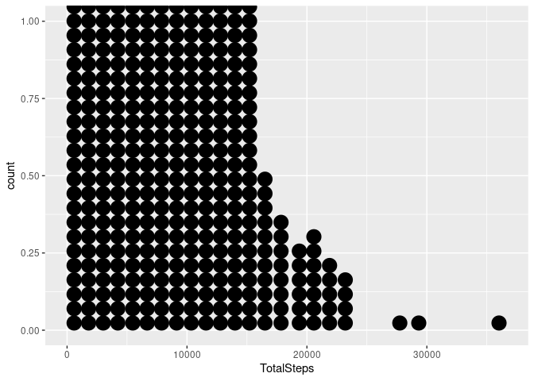<!-- -->

Let’s make histograms of Total Steps and Sedentary Minutes.

``` r
hist(d_Activity_clean$TotalSteps, main="Distribution of Total Steps", xlab="Total Steps", ylim=c(0, 130), xaxp=c(0, 40000, 1000), breaks=seq(0, 40000, 1000))
```

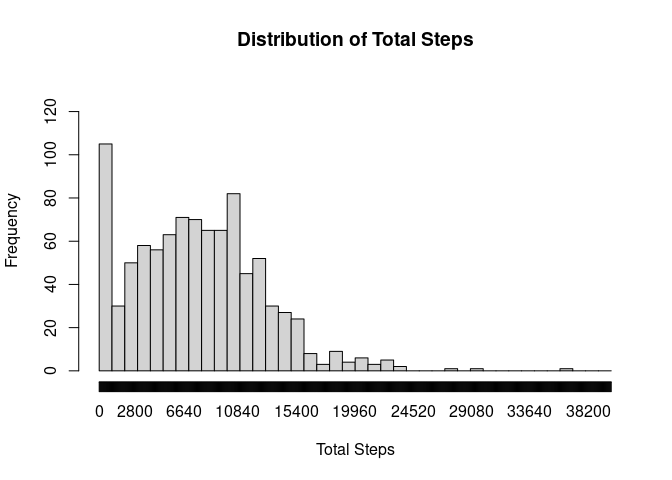<!-- -->

Total Sedentary Minutes:

``` r
hist(d_Activity_clean$SedentaryMinutes, main="Distribution of Sedentary Minutes", xlab="Sedentary Minutes",xaxp=c(0,1500,60), breaks=seq(0,1500,60))
```

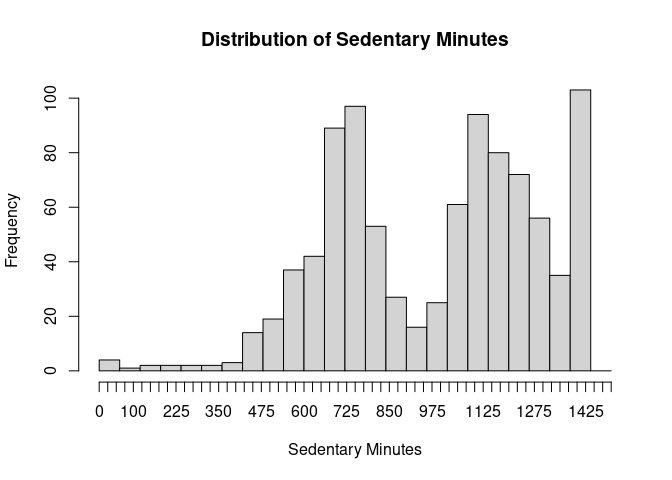<!-- -->

Total Active Minutes:

``` r
hist(d_Activity_clean$TotalActiveMinutes, main="Distribution of Total Active Minutes", xlab="Total Active Minutes",xaxp=c(0,700,50), breaks=seq(0,700,50))
```

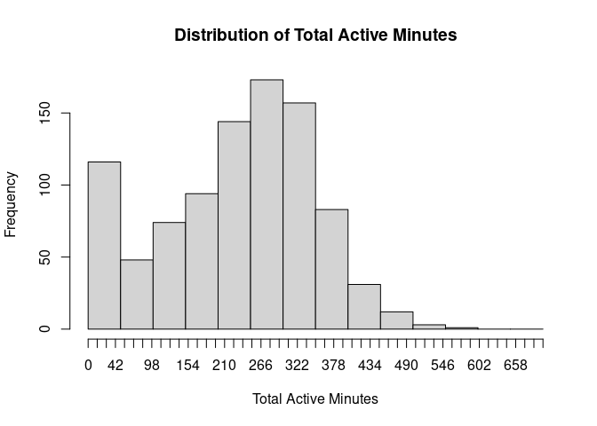<!-- -->

I want to explore if there is a relationship between de number of steps
and the day of the week. For that reason, another column of the
d_Activity_clean table must be added, stating the day of the give for
every reported date:

First we standardize the data format:

``` r
d_Activity_clean$ActivityDate <- format(as.Date(d_Activity_clean$ActivityDate, format="%m/%d/%Y"),"%Y/%m/%d")
```

I will set the data class to “date”.

``` r
d_Activity_clean$ActivityDate <-as.Date(d_Activity_clean$ActivityDate)
head(d_Activity_clean)
```

    ## # A tibble: 6 × 16
    ##           Id ActivityD…¹ Total…² Total…³ Track…⁴ Logge…⁵ VeryA…⁶ Moder…⁷ Light…⁸
    ##        <dbl> <date>        <dbl>   <dbl>   <dbl>   <dbl>   <dbl>   <dbl>   <dbl>
    ## 1 1503960366 2016-04-12    13162    8.5     8.5        0    1.88   0.550    6.06
    ## 2 1503960366 2016-04-13    10735    6.97    6.97       0    1.57   0.690    4.71
    ## 3 1503960366 2016-04-14    10460    6.74    6.74       0    2.44   0.400    3.91
    ## 4 1503960366 2016-04-15     9762    6.28    6.28       0    2.14   1.26     2.83
    ## 5 1503960366 2016-04-16    12669    8.16    8.16       0    2.71   0.410    5.04
    ## 6 1503960366 2016-04-17     9705    6.48    6.48       0    3.19   0.780    2.51
    ## # … with 7 more variables: SedentaryActiveDistance <dbl>,
    ## #   VeryActiveMinutes <dbl>, FairlyActiveMinutes <dbl>,
    ## #   LightlyActiveMinutes <dbl>, TotalActiveMinutes <dbl>,
    ## #   SedentaryMinutes <dbl>, Calories <dbl>, and abbreviated variable names
    ## #   ¹​ActivityDate, ²​TotalSteps, ³​TotalDistance, ⁴​TrackerDistance,
    ## #   ⁵​LoggedActivitiesDistance, ⁶​VeryActiveDistance, ⁷​ModeratelyActiveDistance,
    ## #   ⁸​LightActiveDistance

``` r
d_Activity_day<-strftime(d_Activity_clean$ActivityDate, format ="%A")
d_Activity_clean$d_Activity_day<-d_Activity_day
```

``` r
ggplot(data=d_Activity_clean, aes(x=d_Activity_day, y=TotalSteps)) + geom_point()
```

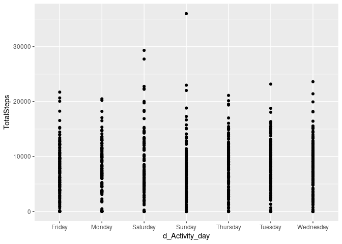<!-- -->

Total Steps:

``` r
ggplot(data=d_Activity_clean, aes(x=ActivityDate, y=TotalSteps)) + geom_point() + scale_x_date(date_labels = "%m/%d")
```

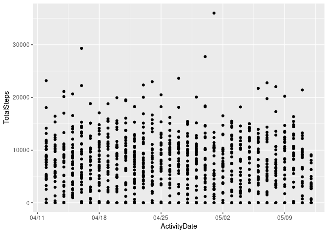<!-- -->

Let’s see the relationship between Total Active Minutes and Sedentary
Minutes:

``` r
ggplot(data=d_Activity_clean, aes(x=SedentaryMinutes, y=TotalActiveMinutes)) + geom_count()
```

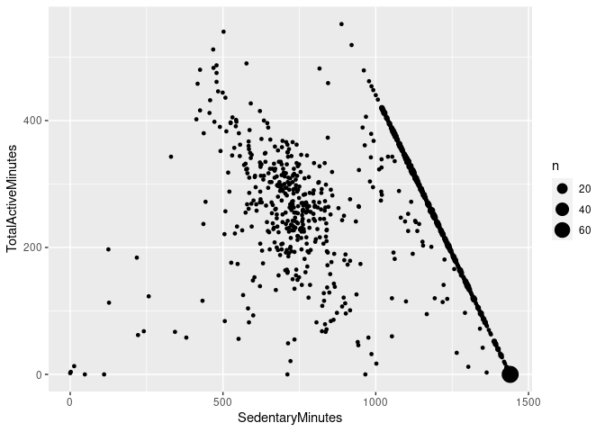<!-- -->

``` r
ggplot(data=d_Activity_clean, aes(x=TotalDistance, y=TotalActiveMinutes)) + geom_count()
```

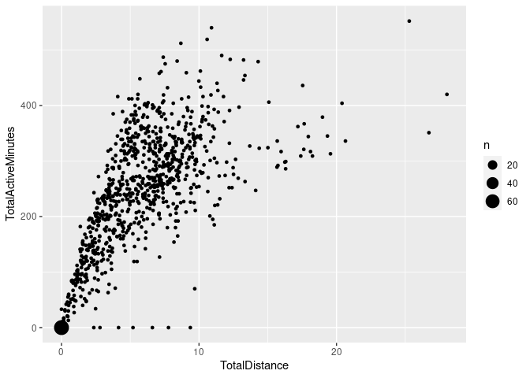<!-- -->

Now going over the **d_Sleep_clean** dataframe:

``` r
ggplot(data=d_Sleep_clean, aes(x=TotalMinutesAsleep)) + geom_bar(stat="count") 
```

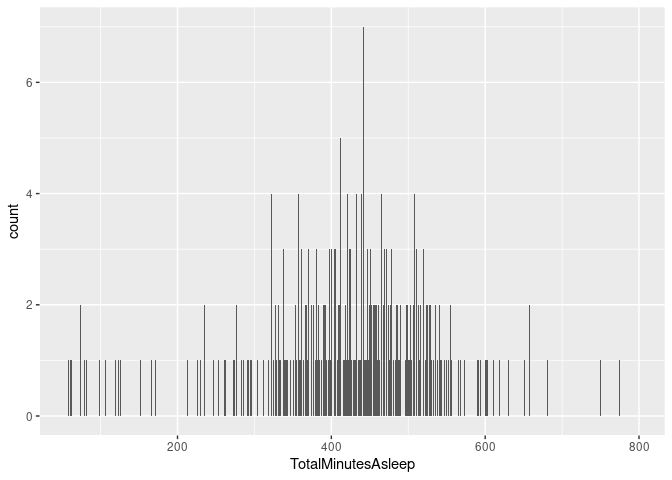<!-- -->

``` r
ggplot(data=d_Sleep_clean, aes(x=TotalTimeInBed)) + geom_bar(stat="count") 
```

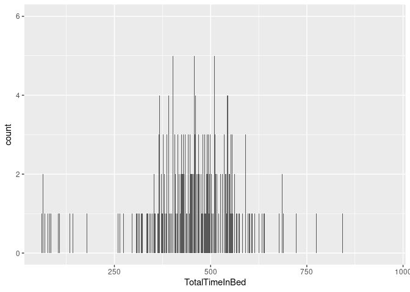<!-- -->

``` r
ggplot(data=d_Sleep_clean, aes(x=TotalMinutesAsleep, y=TotalTimeInBed)) + geom_count()
```

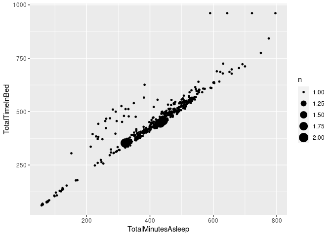<!-- -->

I would like to explore if there is a relationship between Minutes
asleep and day of the week. First I will standarize the data format:

``` r
d_Sleep_clean$SleepDate <- format(as.Date(d_Sleep_clean$SleepDate, format="%m/%d/%Y"),"%Y/%m/%d")
```

``` r
d_Sleep_day<-strftime(d_Sleep_clean$SleepDate, format ="%A")
d_Sleep_clean$d_Sleep_day<-d_Sleep_day
```

``` r
ggplot(data=d_Sleep_clean, aes(x=d_Sleep_day, y=TotalMinutesAsleep)) + geom_point()
```

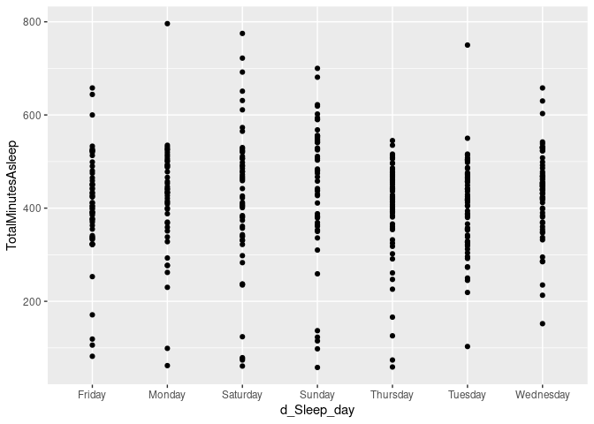<!-- -->

I will now merge the **d_Activity_clean** information with the
**d_Sleep_clean** information.

``` r
d_Sleep_Activity_merged <- merge(d_Activity_clean, d_Sleep_clean, by.x=c('Id','ActivityDate'), by.y=c('Id','SleepDate')) 
```

Now I will plot some variables to search for tendencies:

``` r
ggplot(data=d_Sleep_Activity_merged, aes(x=TotalMinutesAsleep, y=TotalSteps)) + geom_point()
```

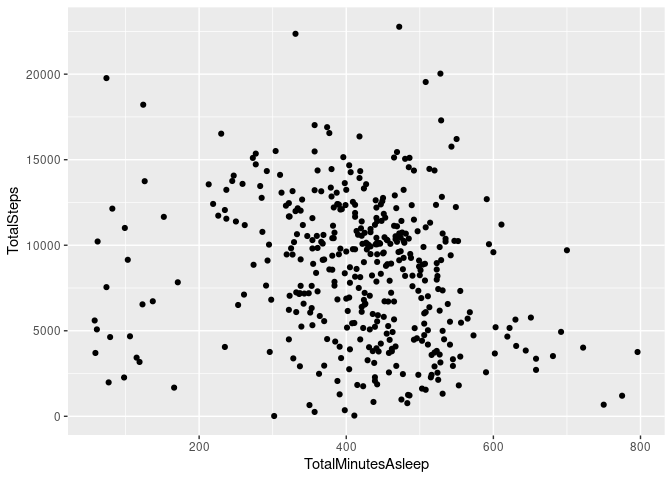<!-- -->

``` r
ggplot(data=d_Sleep_Activity_merged, aes(x=TotalMinutesAsleep, y=TotalSteps)) + geom_point()
```

<!-- -->

## Conclusions

- The data reviewed was provided by 33 users for the daily activity
  measures (Steps, Distance, Active and Sedentary Minutes, etc), 24
  users for the sleep related measures, and 8 users for the weight
  measures.

- Analyzing the statistical values for each sample, the following
  results are gathered for the mean values of each variable:

– Total Steps: 7671 – Total Active Minutes: 228.5 – Total Sedentary
Minutes: 989.3

– Total Asleep Minutes:419.2 – Total Minutes in Bed: 458.5

- The recommended value for daily steps is 10000 steps per day. That
  means the average steps per day recruited from the existing data fells
  short on this recommendation.

- There is some relationship between total active minutes and distance,
  which could mean that most of the active moments in the day involve a
  displacement (walking, jogging, running).

- The strong correlation between total active minutes and sedentary
  minutes in the 1000-1500 region of the axis shows users that had the
  FitBit tracker on the entire day, having reported their activities for
  1440 minutes (24 hours). The plot left to that line shows users who
  didn’t use their tracker device for the whole day.

- There is no strong relationship between the physical activity and the
  days of the week.

- The recommended value for hours of sleep is 8 hours per day, while the
  average value obtained for the existing data shows around 6,98
  hours/per day.

- Saturdays seem to be the day where the users spend more hours
  sleeping. There is an almost direct relationship between hours asleep
  and hours in bed, with some users registering awake time in bed
  (average 1 hour).

- From the weight data provided, it can be determined:

- Only a small group of users provides the weight information

- From the 8 users, 5 are manual reports and 3 are automatic reports
  (provided by a Fitbit device that measures weight)

- Only 2 users provided multiple observations, which could be implied
  that only them were interested on a daily basis follow up of their
  weight, and the others just entered their weight information.

- BMI of 5 out of 8 users is above the recommended for the healthy range
  (24.9), which could mean that users who are on a slimming journey are
  more likely to use this feature.

The recommendations aim to improve the usability of the tracking device,
adding features to improve the user experience.

1.  Motivate to achieve healthier activity goals

Implementing features for the user such as stating goals for the number
of steps per day, sending notifications when goals aren’t reached and
establishing a rewards program, unlocking prizes such as discount
coupons for Bellabeat purchases or partner companies in the
nutrition/fitness industry willing to participate in the program. A
competition feature to share and compete with other users can be
implemented. This recommendation also aims to motivate the users to keep
on the tracking device all day everyday.

2.  Help achieve healthier sleep goals

Implementing features such as offering guided meditation activities,
relaxing playlist or podcasts. Also allowing the user to set goals for
the going to bed and waking up time, and sending notifications stating
the pros and cons of sleeping above or below the recommended value.

3.  Implement a nutrition feature

The amount of users reporting their weight is significantly lower than
the other features in the app, that is because it requires the user to
input the data or weight themselves on a device connected to the
tracking device. To help increase the usability of this feature, besides
reporting weight, several nutrition programs could be offered according
to the necessity of the user (improve body composition, decrease fat
percentage, increase lean muscle mass, etc). Also exercises routines
could be added (gym/yoga/HIIT). This features could allow the users to
personalize their fitness and nutrition journey and motivate them to
keep track of their weight, as well as adding value to the app.
